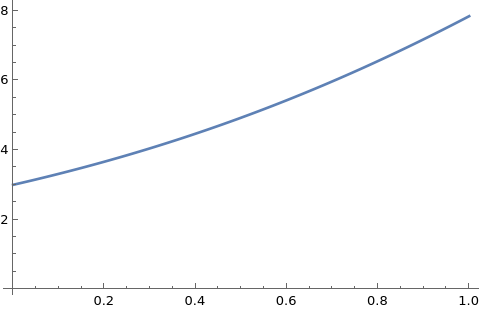

# Euler method for solving differential equation

Let's consider the problem
$$y'=y-x^3$$
$$y(0)=3$$
This Cauchy problem has a solution by method that is called "Cauchy method with recounting".
## Results
After applying this method we got numerical solution and create a graph in Wolfram 14.1

This solution is approximately close to the true solution. In order to compare solution gotten by Euler recounting method that can be gotten by using tools of Wolfram Mathematica in order to provide the analytical solution.
